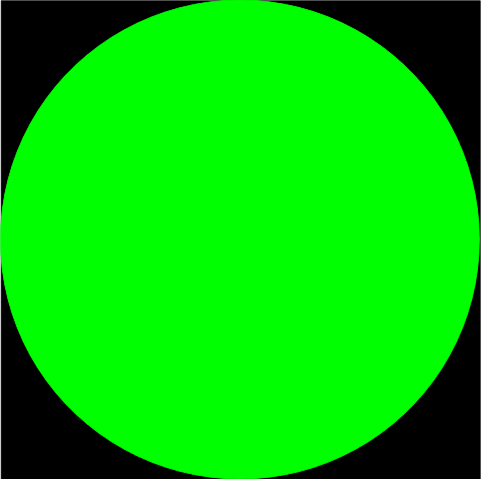
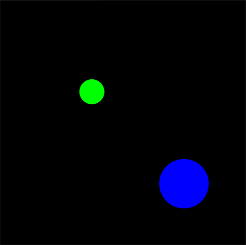

<!-- License

Copyright 2022 Neuromechatronics Lab, Carnegie Mellon University (a.whit)

Created by: a. whit. (nml@whit.contact)

This Source Code Form is subject to the terms of the Mozilla Public
License, v. 2.0. If a copy of the MPL was not distributed with this
file, You can obtain one at https://mozilla.org/MPL/2.0/.
-->


# tkinter_spheres_environment_gui

Tkinter-based 2D graphical interface for a virtual environment in which 
spherical objects interact in a 3D space.

This package creates a 2D graphical user interface (GUI) using [tkinter] and 
the [tkinter_shapes] Python package. The GUI consists of a canvas upon which 
circular objects can be drawn (see images below). The intention is for this 
canvas to act as a representation of a behavioral task environment (e.g., see 
the [example](#getting-started)).

Rather than exposing a completely novel API for this canvas GUI, this 
package borrows the interface defined by the [spheres_environment] Python 
package. This was decision was made in order to increase compatibility with 
software designed for the `spheres_environment` package, and vice-versa (e.g., 
this GUI can be used for visualizing a 2D representation of a 3D spheres 
environment). This package ignores the third (`z`) dimension of 3D positions 
when rendering shapes on the canvas.

Note: This documentation sometimes a generalized interpretation of 
[sphere dimensionality]. That is, objects on the canvas will often be 
referred to as _spheres_, even when visually represented as _circles_.

## Installation

This package requires the [tkinter_shapes] and [spheres_environment] Python 
packages. These requirements must be installed prior to using this package.

To facilitate package installation via [setuptools], `pyoproject.toml` and 
`setup.cfg` files have been provided. Package installation can be accomplished 
via the [pip install] command:

```
pip install path/to/tkinter_spheres_environment_gui
```

The upgrade (`-U`), user, and editable / development (`-e`) flags are common 
options that can be added to the command:

```
pip install --upgrade --user --editable path/to/tkinter_spheres_environment_gui
```

## Getting started

Perhaps the best way to introduce the package functionality is via an example. 
For this example, it will be assumed that the objective is to create an 
environment where a spherical cursor can be moved around a two-dimensional 
plane to interact with a set of spherical targets. As noted previously, 
however, the third (`z`) dimension of the spheres will be ignored for the sake 
of visualization; that is, the spheres will be represented as circles on the 2D 
canvas plane (see images below).

The first step is to create an environment. This initializes a top-level GUI 
window, with a blank canvas.

```python
>>> from tkinter_spheres_environment_gui import Environment
>>> environment = Environment()

```

Add a spherical cursor to the environment. Although the GUI will not change 
(without further action), it can be verified that the cursor object has been 
added to the environmental state. The parameters of the cursor are set to some 
default values. <!-- The default color of the sphere on the canvas is black. -->

```python
>>> cursor = environment.initialize_object('cursor')
>>> environment['cursor']
{'position': {'x': 0.0, 'y': 0.0, 'z': 0.0}, 'radius': 1.0}

```

To make the sphere visible, change the cursor color to green and update the 
canvas. Sphere colors are specified via an [RGBA] color model, where values can 
range from `0.0` to `1.0`. Due to limitations of tkinter, the alpha parameter 
of the color model is thresholded: the object is completely transparent for any 
values less than `1.0`.

```python
>>> cursor.color = (0.0, 1.0, 0.0, 1.0)
>>> environment.update()

```

The canvas should now appear as shown in Figure 1. The cursor fills the center 
of the canvas, because the radius is set to `1.0` and the sphere is positioned 
at the origin. The canvas GUI uses normalized coordinates that range from `-1` 
to `+1` in each dimension. The cursor radius is expressed in terms of these 
coordinates. Therefore, a unit radius will result in a diameter two circle, 
which intersects with the edges of the workspace.



Set new parameters to re-size and re-position the cursor.

```python
>>> cursor.radius = 0.1
>>> cursor.position = (-0.25, 0.25, 1.0)
>>> environment.update()

```

The canvas should now appear as in Figure 2. The cursor is smaller and is away 
from the origin. Note that the 3rd (`z`) coordinate of the cursor position is 
set arbitarily, and that this has no visible effect.


Add a target to the workspace, and similarly set parameters.

```python
>>> target = environment.initialize_object('cursor')
>>> target.color = (0.0, 0.0, 1.0, 1.0)
>>> target.radius = 0.2
>>> target.position = (0.5, -0.5, 0.0)
>>> environment.update()
>>> environment
['cursor', 'target']

```

The canvas should now appear as in Figure 3. Both a cursor and a target are 
visible on the canvas.



Move the cursor to intersect with the target. The canvas should now appear as 
in Figure 4.

```python
>>> cursor.position = (0.35, -0.35, 1.0)
>>> environment.update()

```


Even thought the 3rd (`z`) coordinate of the cursor position exceeds that of 
the target position, the target appears in the foreground. This is because the 
canvas is 2D, and the third coordinate does not affect visualization. To ensure 
that the cursor is always visible, change the z-order of the cursor and target 
by raising the cursor to the foreground.

```python
>>> cursor.to_foreground()
>>> environment.update()

```

The canvas should now appear as in Figure 5.


Finally, clean up by destroying the environment. This closes the GUI window. 
This step is not strictly necessary, as the GUI will otherwise be destroyed 
when the environment is implicitly deleted by the Python environment.

```python
>>> del environment

```

### Example doctests

The examples in this README are rendered in [doctest] format, and can be run 
via the following code:[^python_paths]

[^python_paths]: Provided that the package is installed, or the [Python path] 
                 is otherwise set appropriately.

```
import doctest
doctest.testfile('README.md', module_relative=False)

```

## License

Copyright 2022 [Neuromechatronics Lab][neuromechatronics], 
Carnegie Mellon University

Created by: a. whit. (nml@whit.contact)

This Source Code Form is subject to the terms of the Mozilla Public
License, v. 2.0. If a copy of the MPL was not distributed with this
file, You can obtain one at https://mozilla.org/MPL/2.0/.

<!---------------------------------------------------------------------
   References
---------------------------------------------------------------------->

[tkinter]: https://docs.python.org/3/library/tkinter.html

[Python path]: https://docs.python.org/3/tutorial/modules.html#the-module-search-path

[doctest]: https://docs.python.org/3/library/doctest.html

[setuptools]: https://setuptools.pypa.io/en/latest/userguide/quickstart.html#basic-use

[neuromechatronics]: https://www.meche.engineering.cmu.edu/faculty/neuromechatronics-lab.html

[tkinter_shapes]: https://github.com/ricmua/tkinter_shapes

[pip install]: https://pip.pypa.io/en/stable/cli/pip_install/

[spheres_environment]: https://github.com/ricmua/spheres_environment

[sphere dimensionality]: https://en.wikipedia.org/wiki/Sphere#Dimensionality

[RGBA]: https://en.wikipedia.org/wiki/RGBA_color_model

